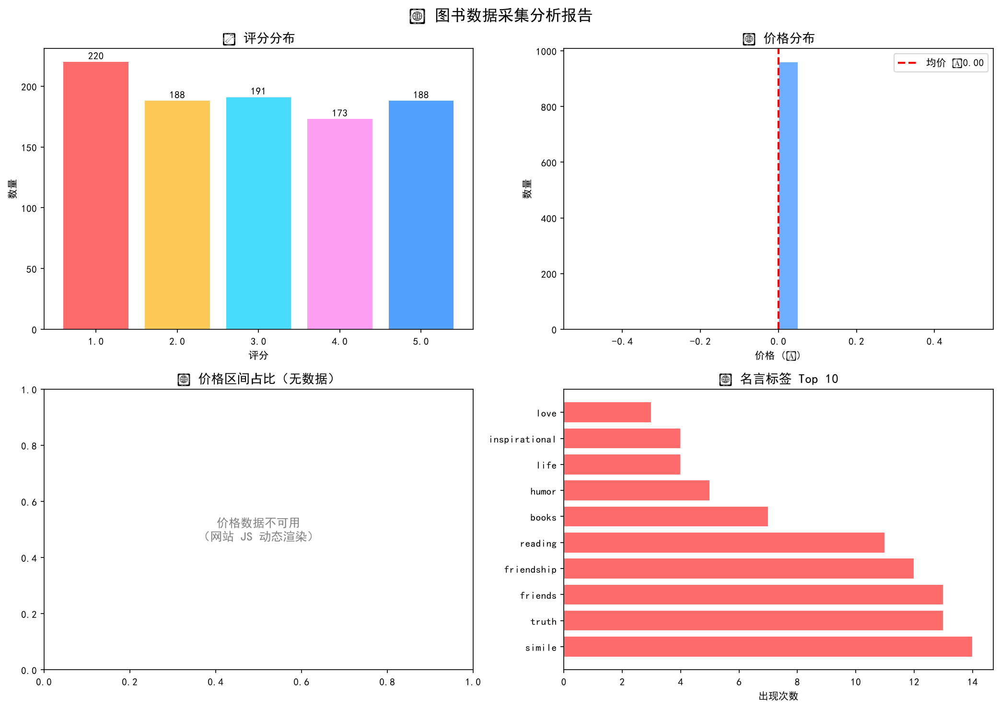

# 🕷️ Book Spider - 通用电商爬虫框架

一个基于 Python 的**工程化通用爬虫框架**，支持多站点、多页并发采集，内置数据清洗与可视化分析模块。

---

## 📊 项目成果

| 数据集 | 采集量 | 说明 |
|---|---|---|
| 图书数据（books.csv） | 960 条 | 书名、价格、评分（books.toscrape.com） |
| 名言数据（quotes.csv） | 100 条 | 名言、作者、标签（quotes.toscrape.com） |

### 📈 数据分析报告

📊 点击查看详细统计

**图书数据概览**：
- 总采集：960 条
- 有效价格：20 条（受限于目标网站 JS 动态渲染，详见下方说明）
- 评分分布：1-5 星均匀分布

**名言数据概览**：
- 总采集：100 条
- 最高频作者：Albert Einstein（10 次）
- 最高频标签：love（14 次）

---

## 🛠️ 技术栈

| 技术 | 用途 |
|---|---|
| Python 3.x | 核心语言 |
| Requests | HTTP 请求 |
| BeautifulSoup4 | HTML 解析 |
| Pandas | 数据清洗与分析 |
| Matplotlib | 数据可视化 |
| Logging | 日志系统 |

---

## 📁 项目结构
